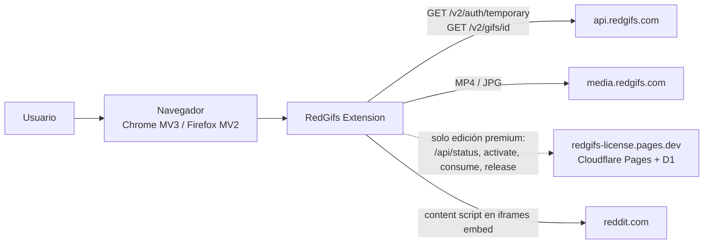
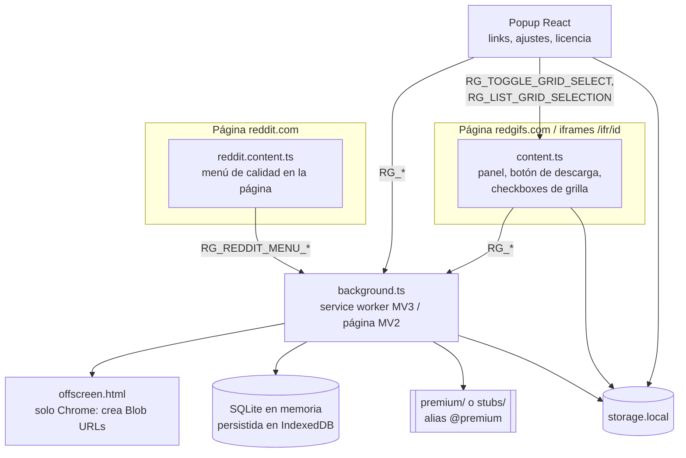

# Arquitectura

Extensión WebExtension con cuatro contextos de ejecución que hablan por `runtime.sendMessage`. **El background es la única autoridad**: valida entradas, plan/licencia, descarga y base de datos. Los demás contextos solo presentan UI y recogen datos de la página.

## Contexto del sistema

## Contenedores (contextos de ejecución)

| Contexto | Archivo | Responsabilidad | Doc |
| --- | --- | --- | --- |
| Background | `entrypoints/background.ts` | API RedGifs, descargas, DB, autorización premium | [background](../03-services/background.md) |
| Content script RedGifs | `entrypoints/content.ts` (`matches: *://*.redgifs.com/*`, `allFrames: true`) | Detectar video activo, scrapear metadatos, UI en página | [content-redgifs](../03-services/content-redgifs.md) |
| Content script Reddit | `entrypoints/reddit.content.ts` (`matches: *://reddit.com/*, *://*.reddit.com/*`) | Mostrar el menú de calidad fuera del iframe del embed | [content-reddit](../03-services/content-reddit.md) |
| Popup | `entrypoints/popup/` | Lista de links, ajustes, licencia | [popup](../03-services/popup.md) |
| Offscreen | `entrypoints/offscreen/` | Crear Blob URLs en Chrome MV3 | [offscreen](../03-services/offscreen.md) |

## Piezas transversales

- **Alias `@premium`** (`wxt.config.ts`): en `--mode basic` apunta a `stubs/premium`; en cualquier otro modo a `premium/`. El código premium no entra en el paquete básico. Ver [ADR 0001](../02-architecture/decisions/0001-ediciones-de-build.md).
- **Constante `HAS_PREMIUM`** (`utils/edition.ts`): `false` en `basic`, el bundler elimina el código bajo `if (HAS_PREMIUM)`.
- **Contrato de mensajes** tipado en `utils/messages.ts` ([protocolo](../04-apis/messages.md)).
- **Persistencia**: SQLite (sql.js) en IndexedDB para links; `storage.local` para ajustes y licencia ([base de datos](../07-data/database.md), [storage](../catalogs/storage-keys.md)).

## Diferencias Chrome / Firefox

| Aspecto | Chrome (MV3) | Firefox (MV2) |
| --- | --- | --- |
| Background | service worker | página de background (`scripts`) |
| Blob URL del MP4 con metadatos | documento offscreen (permiso `offscreen` añadido por el hook `build:manifestGenerated`) | se crea en el propio background y se descarga con un `<a download>` |
| Imagen de captura de fotograma | offscreen | `URL.createObjectURL` en background |

Fuente: `wxt.config.ts`, `entrypoints/background.ts` (`startVideoDownload`, `startFrameDownload`). Verificado el 2026-10-10 con `pnpm build:basic`, `build:premium`, `build:activated` y `pnpm wxt build --mode basic -b firefox`.
