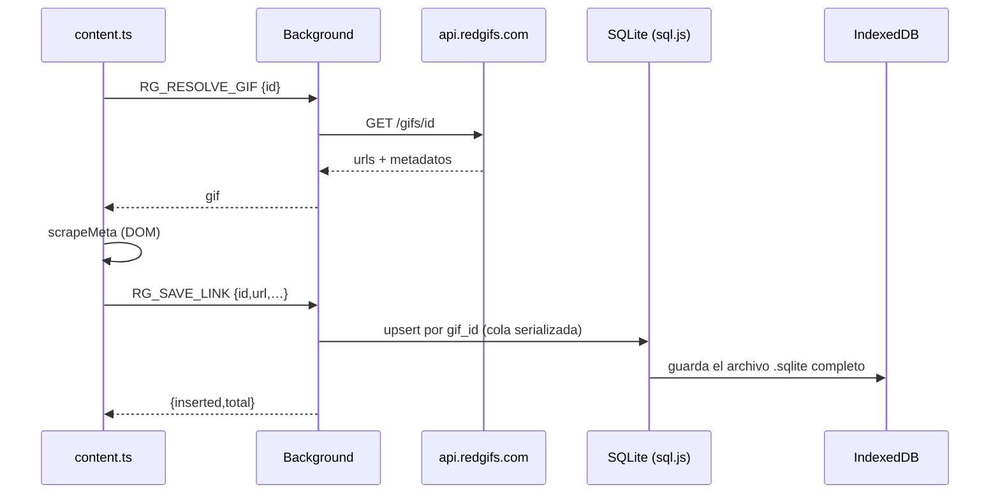

# Flujo de datos

## Guardar un link (gratis)

El auto-guardado (`rgAutoSave`) ejecuta el mismo flujo al detectar un video nuevo si las vistas superan `rgAutoSaveMinViews`.

## Guardar en lote (premium)

Popup activa la selección → usuario marca thumbnails → «Save selected» resuelve cada id (`RG_RESOLVE_GIF`) → `RG_SAVE_BULK` → `premium.saveBulk` valida cada elemento y llama `saveLink` uno a uno.

## Exportar / importar

- Exportar (premium): `RG_EXPORT_DB` → `premium.exportLinks` → `{base64,filename,mime}` → el content/popup lo convierte en archivo.
- Importar: `RG_IMPORT_DB` → `importDb` abre el archivo con sql.js y hace `upsert` por `gif_id` (sin duplicados).

## Datos que salen del navegador

| Destino | Qué se envía | Cuándo |
| --- | --- | --- |
| `api.redgifs.com`, `media.redgifs.com` | ids de GIF y peticiones de media | al resolver y descargar |
| Servidor de licencias | `installId` (UUID aleatorio) y la clave de licencia al activar | solo edición `premium` |

Los links guardados **no** se envían a ningún servidor (comentario de `wxt.config.ts`: «Los GIF guardados quedan en local»).
