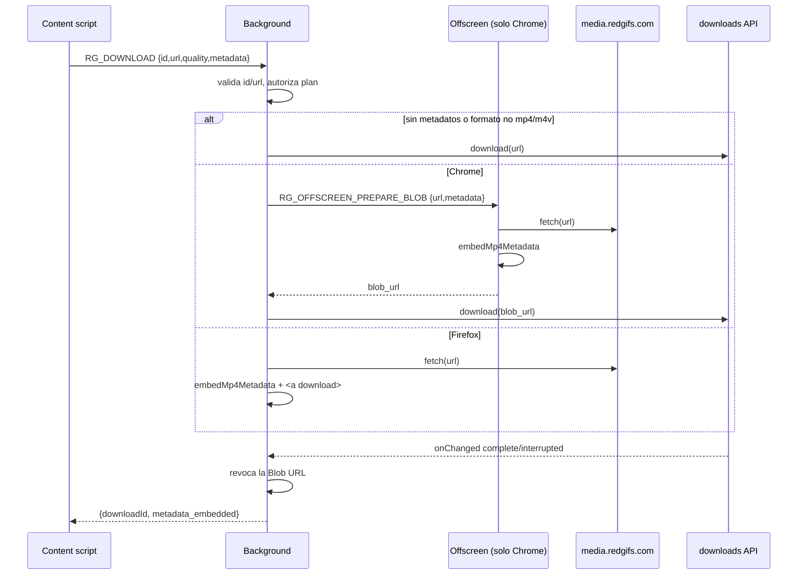

# Background

Componente central de la extensión: recibe todos los mensajes `RG_*`, habla con la API de RedGifs, descarga archivos y es la **autoridad del plan** (premium/gratis). Léelo antes de añadir un mensaje o una función con restricción de plan.

## Responsabilidad y límites

Hace: resolver GIFs contra la API, descargar videos/imágenes (con reintentos), incrustar metadatos MP4, mantener la base SQLite, validar licencia, relevar el menú de calidad entre iframe y página de Reddit.
No hace: scrapear el DOM ni pintar UI (eso es de los content scripts y el popup).

## Entrada y despacho

`defineBackground` registra un `runtime.onMessage`:

1. `RG_REDDIT_MENU_OPEN` y `RG_REDDIT_MENU_SELECTED` se tratan aparte (reenvío entre frames, ver [content-reddit](content-reddit.md)).
2. Todo lo demás pasa por `handle(msg)` (un `switch` sobre `msg.type`). Siempre responde `{ok:true,…}` o `{ok:false,error}`; el listener devuelve `true` (respuesta asíncrona).

Tabla completa de mensajes: [protocolo](../04-apis/messages.md).

## Validaciones de entrada

- `ID_RE = /^[\w-]+$/` para ids de GIF.
- `isRedgifsUrl`: solo `https` y host `redgifs.com` o `*.redgifs.com`; se aplica a `RG_DOWNLOAD`, `RG_SAVE_LINK` y a las URLs devueltas por la API.
- Nombres de archivo: solo `[\w-]+.(mp4|m4v|jpg|jpeg|png)`; carpeta fija `redgifs/` dentro de Descargas. Con `useOriginalFilename === false` se usa un UUID aleatorio.

## Control de plan

| Mensaje | Gratis | Premium |
| --- | --- | --- |
| `RG_DOWNLOAD` con `quality: 'sd'` | permitido | permitido |
| `RG_DOWNLOAD` con otra calidad (`hd` por defecto, `image`) | `authorizePremiumAction()` | permitido |
| `RG_DOWNLOAD_FRAME`, `RG_SAVE_BULK`, `RG_DOWNLOAD_ALL`, `RG_EXPORT_DB` | rechazado | `authorizePremiumAction()` |
| `RG_SAVE_LINK`, `RG_STATS`, `RG_CHECK_LINK`, `RG_LIST_LINKS`, `RG_DELETE_LINK`, `RG_IMPORT_DB` | permitido | permitido |

En `basic` (`HAS_PREMIUM === false`) cualquier calidad distinta de `sd` y las funciones premium lanzan `Not available in the basic edition`. Ver [ediciones y licencias](../13-security/editions-and-licensing.md).

## Descarga de video (`startVideoDownload`)

- Si algo falla al incrustar metadatos, **se descarga el video original** y se devuelve `metadata_warning`.
- `downloadWithRetry`: 3 intentos con espera 500 ms · 2^i (500 ms, 1 s).
- Las Blob URLs se revocan cuando la descarga termina o se interrumpe; las creadas con `<a download>` expiran a los 15 min.
- No se registra `downloads.onDeterminingFilename` a propósito (comentario en el código: Chrome solo deja decidir el nombre a una extensión y pisaría a las demás).

## Estado en memoria

`redgifsToken`, mapas de Blob URLs, sugerencias de nombre (60 s) y destinos de menú de Reddit. Se pierde cuando el service worker se suspende; el token se vuelve a pedir en el siguiente uso.

## Dependencias

Internas: `@premium` (alias), `utils/links-db`, `utils/license`, `utils/mp4-metadata`, `utils/messages`. Externas: API de RedGifs ([doc](../04-apis/redgifs-api.md)), servidor de licencias.

## Seguridad

Sin comprobación de `sender.id` (comentario en el código: Chrome puede omitirlo en mensajes de content scripts). Todo premium se revalida aquí, nunca solo en la UI. Ver [permisos](../13-security/permissions.md).

## Deuda técnica

- El bloque `try { … } catch (downloadError) { throw downloadError }` en `startVideoDownload` es redundante.
- Los `console.info/debug` verbosos permanecen en producción.
