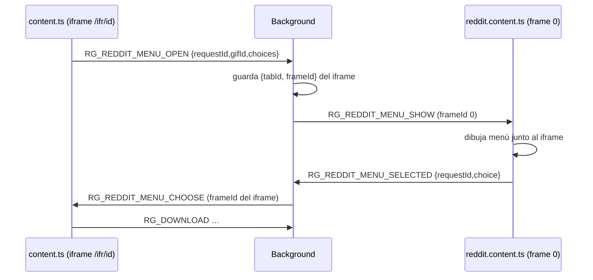

# Content script de Reddit (`entrypoints/reddit.content.ts`)

Corre en `*://reddit.com/*` y `*://*.reddit.com/*` (solo el frame principal). Su función real hoy es **dibujar el menú de calidad** (HD/SD/Imagen/Fotograma) fuera del iframe del embed de RedGifs, porque el iframe es demasiado pequeño.

## Flujo del menú

El background rechaza `OPEN` si el emisor es el frame 0, y `SELECTED` si no viene del frame 0 de la misma pestaña (`pendingRedditMenuTargets`).

## Código heredado

`scan()` hoy **solo elimina** paneles antiguos (`.rg-reddit-download-tools`); la inyección de botones propia de Reddit (`installOn`, `showQualityMenu`, `createDownloadButton`) existe pero ya no se invoca. Comentario del código: las descargas se inyectan ahora desde el content script dentro del frame `/ifr/<id>`. Candidato a limpieza.

## Ajustes que lee

`rgLanguage`, `rgDownloadQuality`, `rgPremium` ([catálogo](../catalogs/storage-keys.md)).
