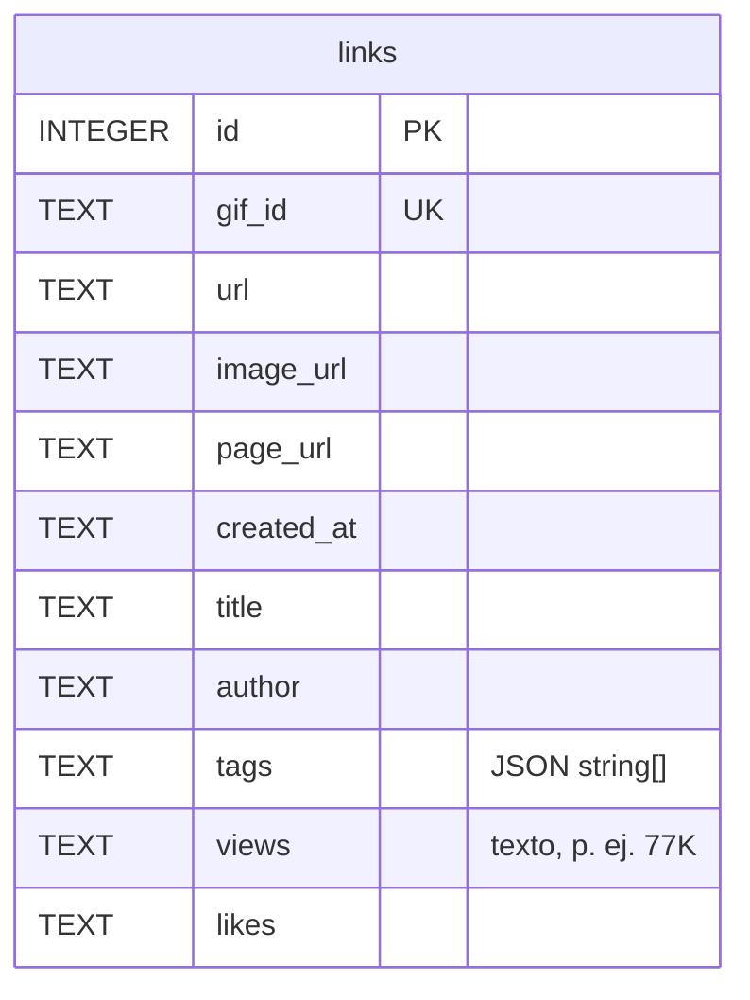

# Base de datos local

SQLite **en memoria** (sql.js, WASM) cuyo archivo completo se serializa a **IndexedDB** tras cada cambio. Sobrevive a reinicios del navegador y del service worker. Vive en el origen de la extensión: es por perfil de navegador y no se sincroniza.

| Elemento | Valor |
| --- | --- |
| IndexedDB | base `rg-links-db`, object store `kv`, clave `sqlite-file` (bytes del `.sqlite`) |
| WASM | `sql.js/dist/sql-wasm-browser.wasm`, copiado como asset por Vite |
| CSP necesaria | `script-src 'self' 'wasm-unsafe-eval'` (`wxt.config.ts`) |
| Concurrencia | cola de promesas: todas las operaciones se ejecutan de una en una |

## Esquema

Índice: `idx_links_created_at (created_at)`. `created_at` por defecto `datetime('now')`.

## Migraciones

No hay versionado: `migrate()` compara `PRAGMA table_info(links)` y añade con `ALTER TABLE` las columnas que falten (`image_url`, `title`, `author`, `tags`, `views`, `likes`). Si faltaba `image_url`, rellena filas antiguas con `<url sin .mp4>-mobile.jpg`.

## Reglas de negocio

- `gif_id` es único: nunca hay duplicados.
- Al guardar un link existente: `image_url`, `title`, `author` solo se completan si estaban vacíos; `tags`, `views`, `likes` se **refrescan** siempre que lleguen.
- Importar (`importDb`) aplica el mismo upsert fila a fila desde un `.sqlite/.db` externo; si no había base propia, la crea.
- Borrar (`deleteLink`) devuelve el nuevo total.

## Datos personales y retención

Contiene historial de contenido que la persona guardó (URLs, títulos, autores). No hay política de retención ni cifrado en el código; los datos solo salen del navegador si el usuario exporta o comparte el archivo. [Pendiente de confirmar]: política de privacidad de la extensión.
