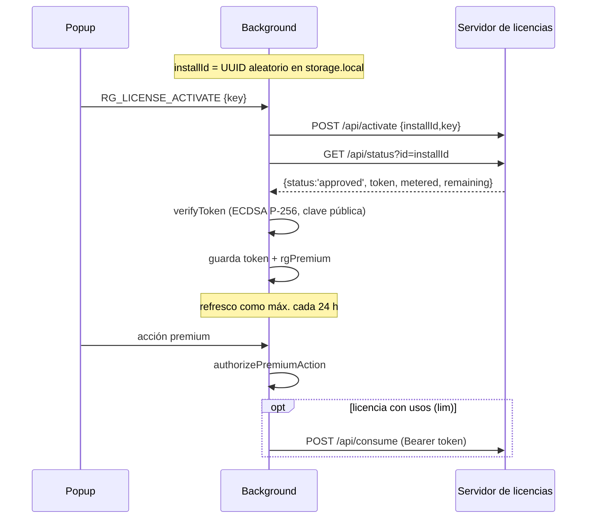

# Ediciones y licencias

Cómo se decide qué puede hacer cada usuario. Léelo antes de tocar `utils/license.ts`, `utils/edition.ts` o cualquier función premium.

## Tres ediciones

| Edición | Cómo se compila | Premium | Servidor de licencias | Distribución |
| --- | --- | --- | --- | --- |
| `basic` | `pnpm build:basic` (alias `@premium` → `stubs/`) | Inexistente: el código no entra en el paquete | No (sin host permission ni red) | Pública |
| `premium` | `pnpm build:premium` (y cualquier otro modo) | Bloqueado hasta tener token válido | Sí (`LICENSE_SITE`) | Pública / tiendas |
| `activated` | `pnpm build:activated` | Siempre activo | No | **Nunca**: uso personal (el nombre del paquete es «RedGifs Extension (activated, personal)») |

Comprobado el 2026-10-10: `host_permissions` incluye `https://redgifs-license.pages.dev/*` solo en `premium`, y `data_collection_permissions` de Firefox es `technicalAndInteraction` solo en `premium` (en las otras `none`).

## Modelo de licencia (edición `premium`)

- El token es `payloadB64.firmaB64`; el payload `{v:1,id,plan:'premium',iat,exp,lim?}`. Solo es válido si la firma verifica, `id` coincide con el `installId` y no venció (`verifyToken`).
- **Falla cerrado**: con la clave pública vacía o un token corrupto, el usuario queda en gratis.
- Sin red: se conserva el token en caché hasta su vencimiento («gracia offline»). Si el servidor responde que no hay licencia, se borra el token.
- `RG_LICENSE_RELEASE` (`POST /api/release`) libera el cupo del email y vuelve a plan gratuito.
- Tiempo máximo de espera de red: 8 s; refresco automático cada 24 h (`REFRESH_AFTER_MS`).

## Qué es gratis y qué premium

Ver tabla en [visión general](../00-overview/project-overview.md#planes-y-ediciones). La regla está en dos sitios: `utils/download-options.ts` (`FREE_DOWNLOAD_OPTIONS`: solo SD) y el `switch` del background ([control de plan](../03-services/background.md#control-de-plan)).

## Límite honesto de seguridad

El código de una extensión es JavaScript visible y modificable. La firma impide activar premium editando `storage`, pero **no** impide parchear el código (lo dice el comentario de `utils/license.ts`). `rgPremium` es solo una bandera de UI; la autoridad es el background.

## Servidor de licencias

No está en este repo. `README-LICENCIAS.md` describe cómo montarlo (Cloudflare Pages Functions + D1: endpoints `/api/status`, `/api/activate`, `/api/consume`, `/api/release`, panel `/admin/`; secretos `LICENSE_PRIVATE_JWK`, `ADMIN_TOKEN`, `RESEND_API_KEY`; variables `MAX_ACTIVATIONS_PER_EMAIL`, `TOKEN_TTL_DAYS`, `NOTIFY_EMAIL`). **No verificado**: el servidor real no es accesible desde aquí.

Reglas de seguridad de esa guía: la clave privada (`d`) nunca va al cliente ni a commits; rotar el par antes de publicar o si se filtra (§9); `.env*` solo lleva configuración de build.

## Riesgos conocidos

- `LICENSE_PUBLIC_JWK` y `LICENSE_SITE` están en el código: si se rota la clave privada, hay que publicar una versión nueva de la extensión.
- La carpeta `premium/` está en este repo; si el repo es público, el código premium es público ([pendiente 6](../README.md#pendiente-de-confirmar)).
- `activated` no debe salir de la máquina de quien lo compila.
